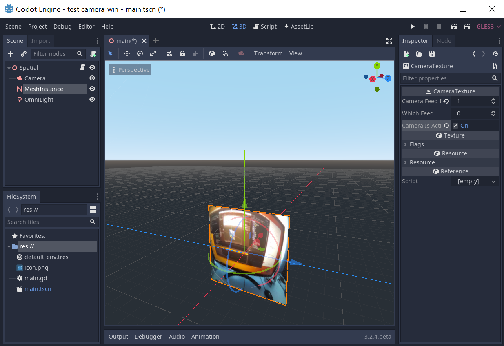
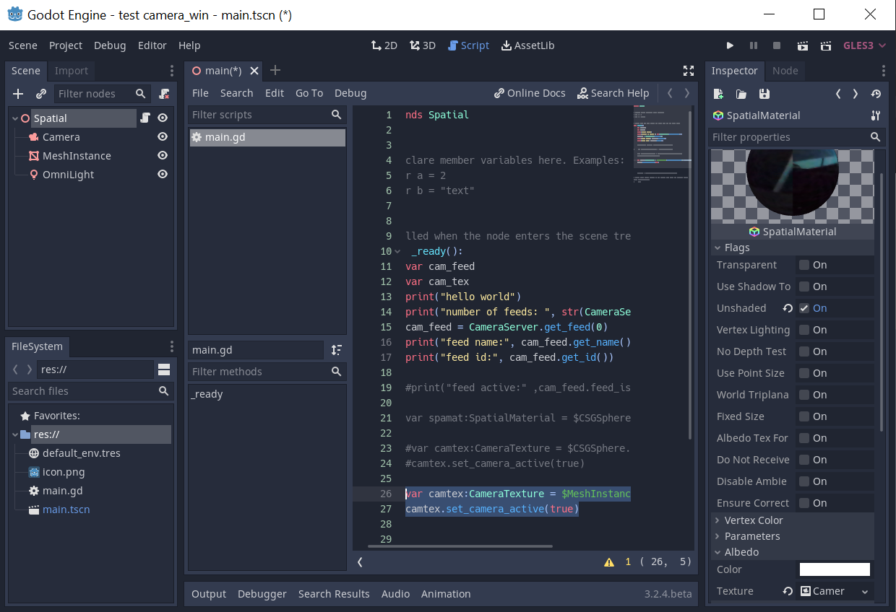
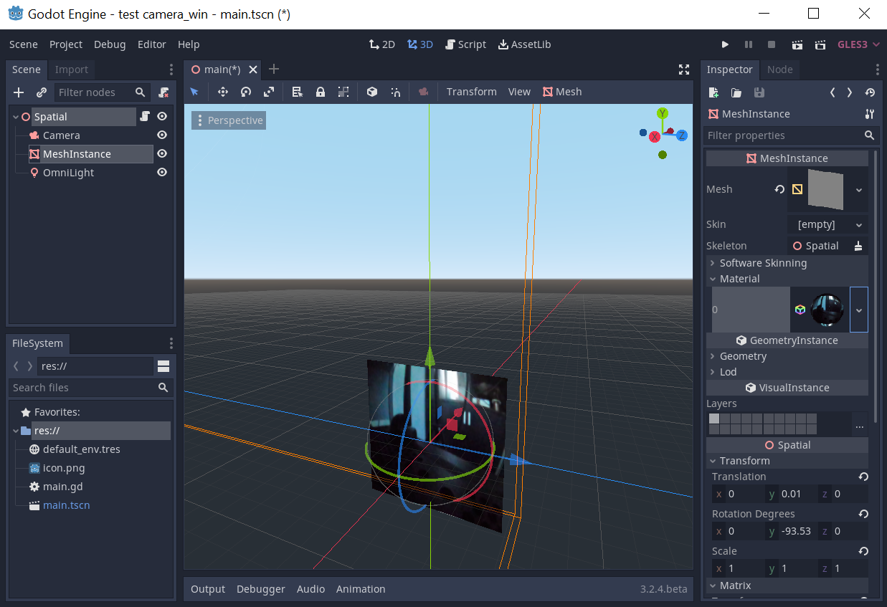

# godot-camera_win-test
godot camera_win test
Remember to deactivate the camera (if you've activated it) before running the application. Windows doesn't like to share cameras.
The scene's cameras are deactivated by default, pictures shows what it looks like in the editor when it is active.

